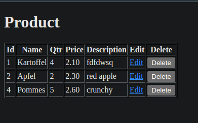
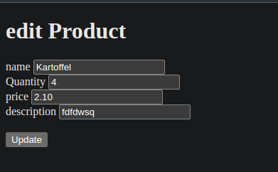
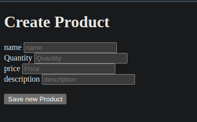

# Title: Laravel crud app

### This project is created  to implement CRUD operations in Laravel. Laravel will be used to create, read, update, and delete data from a database, and i used Mysql commandline and workbench to fill the tables.
